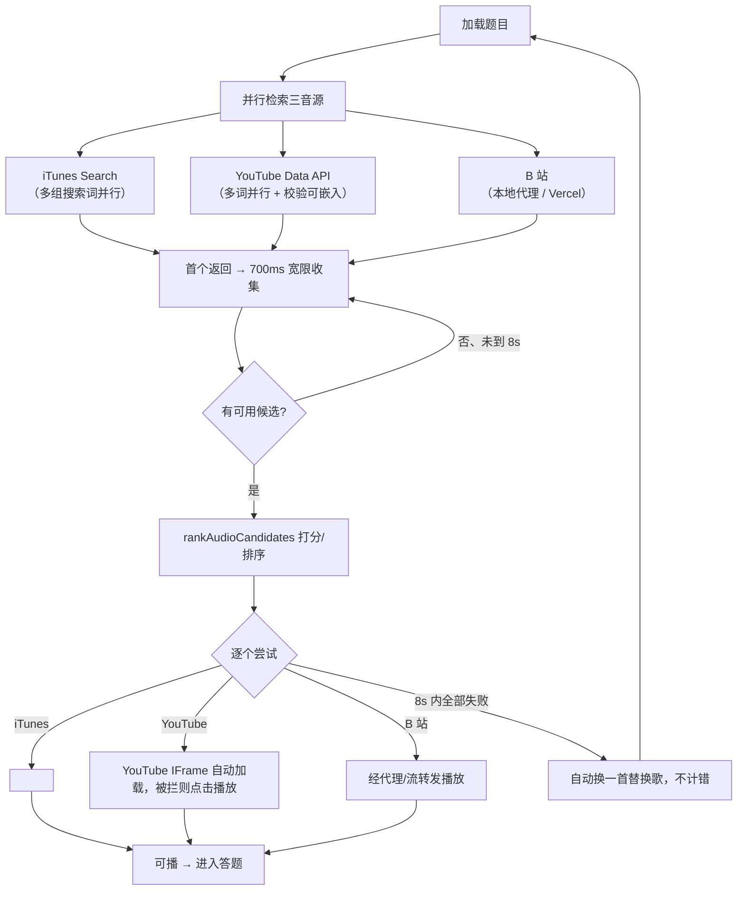
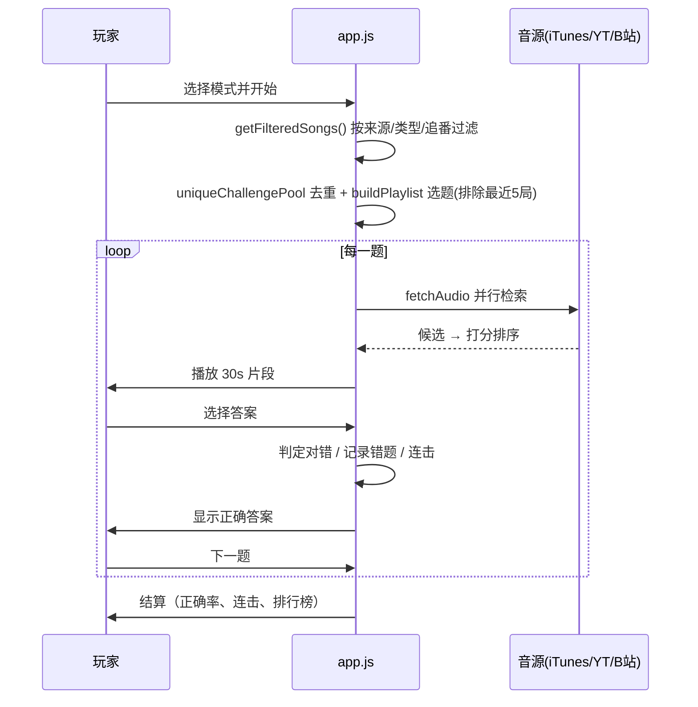

# ♪ 萌豚挑战 · 二次元听歌猜番剧

> 听歌 30 秒，猜出它来自哪部番剧。
> 纯前端、无框架、无构建步骤的二次元音乐猜谜网页游戏。

---

## 一、项目简介

「萌豚挑战」是一款**纯静态网页游戏**：播放一段约 30 秒的动漫歌曲片段，玩家从 4 个选项中猜出答案。数据全部内置在仓库中，音频在游玩时实时从多个公开音源检索。

- **总曲库：345 首歌曲**
  - 官方曲库（`songs.js`）：**285 首 / 188 部番剧**
  - 季度新番（`seasonal-pools.js`）：**2026 春（30 首 / 15 部）+ 2026 夏（30 首 / 15 部）**
- **无打包、无编译**：源码即产物，改完刷新即可看到效果。
- **可部署到 Vercel、GitHub Pages 或任意静态托管**。

### 主要玩法

| 模式 | 玩法 |
|---|---|
| 猜番剧 | 听歌，选出歌曲来自哪部番剧 |
| 猜歌名 | 听歌，选出歌曲名称 |
| 猜歌手 | 听歌，选出演唱者/乐队 |
| 混合模式 | 每题在「番剧 / 歌名 / 歌手」三种题型间随机切换 |

### 主要功能

- **三音源智能选择**：iTunes 30 秒试听、YouTube 嵌入式播放、B 站音频（本地代理 / Vercel 代理）。
- **自动换源 + 自动跳题**：某音源失败时自动尝试其它来源；所有音源都不可用时自动换一首，**不计错误**。
- **「我的曲库」中心**：按番剧分组浏览、搜索、筛选、试听、加自选、标记追番、错题本、音源反馈。
- **Bangumi 目录一键导入**：输入 Bangumi 收藏目录号，自动把收藏的番剧主题曲拉进曲库。
- **自定义曲库导入 / 导出**（JSON）。
- **本地排行榜**（最高连对数、最高连击，存于浏览器）。
- **提示系统**：每题 2 个提示（歌手 / 歌名），使用后本题得分打折。
- **匿名 PK**（遗留功能，基于 Firebase，见下文「遗留模块」）。

---

## 二、技术栈

| 类别 | 技术 |
|---|---|
| 前端 | 原生 HTML / CSS / JavaScript（ES Modules），无框架、无打包 |
| 视频播放 | YouTube IFrame Player API |
| 实时对战（遗留） | Firebase Authentication（匿名）+ Realtime Database（RTDB，`asia-southeast1`） |
| 外部音源 / 元数据 | iTunes Search API、YouTube Data API v3、AniList GraphQL、Bangumi（bgm.tv）REST API |
| 后端 | Node.js Serverless Functions（Vercel）|
| 本地 B 站代理 | Node.js（仅内置模块，零依赖）|
| 数据 / 校验脚本 | Node.js（ESM，`.mjs`），`spark-md5`（用于 Bangumi 密码学签名）|
| 部署 | Vercel（`vercel.json` 配置路由），也可纯静态托管 |
| 测试 | Node.js 内置测试运行器（`node --test`）|

---

## 三、目录结构

```
anime-song/
├── index.html                # 单页面：所有视图（首页/游戏/曲库/对战）与弹窗
├── style.css                 # 全部样式（含响应式、动画、各弹窗）
├── app.js                    # 主程序：游戏循环、音源检索、曲库、收藏、对战等全部前端逻辑
├── audio-selection.mjs       # 音源搜索词构造 + 候选打分/排序 + 曲库去重 + 替换歌选取
├── library-navigation.mjs    # 曲库的搜索/分组/排序、自定义歌曲构建
├── library-tools.mjs         # 公共工具：WBI 签名、Bangumi 图片、番剧元数据、季度歌查找
├── songs.js                  # 官方曲库：285 首
├── seasonal-pools.js         # 季度新番池：2026-04、2026-07 各 30 首
├── seasonal-covers.js        # 季度番剧内置封面：30 张 HTTPS 图
├── candidates.js             # 抓取脚本产生的中间草稿（**不被页面加载**，仅开发用）
├── bili-proxy.mjs            # 本地 B 站音频代理（在你自己电脑上跑）
├── api/
│   └── search.js             # Vercel Serverless：B 站搜索 / 取流 / 流转发 / 热备线路
├── scripts/                  # 数据抓取、更新、校验、审计脚本
│   ├── fetch-season.mjs          # 抓取/筛选季度候选
│   ├── update-season.mjs         # 一键更新季度曲库（CLI 交互）
│   ├── season-updater-tools.mjs  # 一键更新的公共工具（WBI、解析、合并、封面）
│   ├── validate-songs.mjs       # 校验官方曲库与版本号
│   ├── validate-seasons.mjs     # 校验季度曲库（30 首 / 15 部）
│   ├── audit-integrity.mjs       # 数据完整性审计（字段、重复、配对）
│   └── audit-romaji.mjs          # 统计仅含罗马音元数据的季度歌
├── tests/                    # 9 个测试文件（node --test）
├── 一键启动.bat               # Windows：启动本地服务器 + 自动打开网页
├── 启动B站代理.bat            # Windows：启动本地 B 站代理
├── 一键更新季度曲库.bat        # Windows：跑 update-season.mjs
├── vercel.json               # Vercel 路由重写（/api/search 等）
├── package.json              # 脚本与依赖
├── ARCHITECTURE.md           # 旧架构文档（部分内容已过时，以本 README 为准）
├── CLAUDE.md                 # 给 AI 编码助手的项目说明（部分内容已过时）
├── PROJECT_STATUS.md         # 项目交接 / 状态文档（**长期冻结后先看这个**）
└── .github/workflows/        # 定时更新季度曲库的 GitHub Actions
```

---

## 四、核心模块说明

### 前端

- **`app.js`（主程序，`?v=52`）**
  全局状态、游戏循环、音源检索、播放控制、答案判定、提示、结算、排行榜、「我的曲库」、Bangumi 导入、收藏、以及遗留的匿名 PK。是项目的核心，绝大部分逻辑都在这里。

- **`audio-selection.mjs`（`?v=3`）**
  - `audioSearchQueries(song)`：为 iTunes / YouTube / B 站分别构造多组搜索词。
  - `scoreAudioCandidate(song, candidate)` / `rankAudioCandidates(...)`：对每个候选做**标题/番剧/歌手/类型匹配**，过滤翻唱、钢琴、伴奏、错误版本，并打分排序。
  - `uniqueChallengePool(pool)`：按「歌名 + 番剧」去重，保证同一首歌不会在一局里重复出现。
  - `buildPlaylist`：**跨最近 5 局去重**——记录最近 5 局（`played_games_v1`）出现过的歌，选题时优先挑 5 局内没出现过的；若排除后题目不够，会从最旧的一局开始放宽。
  - `pickReplacementSong(...)`：某题不可播时，从池中挑一首未用过的替换歌。

- **`library-navigation.mjs`**
  曲库浏览专用：`searchLibraryTracks`（搜索）、`groupLibrarySongs`（按番剧分组）、`sortLibraryGroups`（排序）、`buildPlaylist`、自定义歌曲记录构建等。

- **`library-tools.mjs`**
  公共纯函数：B 站 WBI 签名相关、Bangumi 图片处理（`resolveBangumiImage`）、番剧元数据、季度歌查找、`filterWatchedSongs`（追番过滤）等。

### 后端

- **`api/search.js`（Vercel Serverless）**
  服务端实现 B 站能力，避免在浏览器里直接调 B 站被 CORS / 风控拦截。支持三类请求：
  - `q=关键词`：服务端 B 站视频搜索；
  - `bvid=...`：返回该视频可直接播放的音频 CDN URL；
  - `stream=...`：服务端流式转发 B 站 CDN 音频（含 3 条热备线路自动切换）。
  - 可选环境变量 `BILI_COOKIE`（登录态）以降低被风控概率。

- **`bili-proxy.mjs`（本地代理，端口 8765）**
  在你自己电脑上运行，从你的网络直接访问 B 站，不会被 Vercel 境外 IP 的风控拦（`no audio stream`）。提供与 Serverless 相同的搜索 / 取流 / 流转发能力，**只用 Node 内置模块、零依赖**。

### 数据

- **`songs.js`**：285 首官方曲库（`OP/ED/IN` 三种类型）。
- **`seasonal-pools.js`**：按 `YYYY-MM` 组织的季度池，每池 15 部番剧 × (OP + ED) = 30 首。
- **`seasonal-covers.js`**：季度番剧的内置封面（避免每次去 AniList 现取）。

---

## 五、实现原理

### 1. 音源解析管线（核心）

每加载一道题，前端会**并行**向各音源检索候选 → 边返回边汇总 → 统一打分 → 按分数从高到低依次尝试播放。

**快速收敛（避免「等最慢的源」）**：三个音源同时发起，谁先返回就先收集；首个音源返回后给其它音源一个约 **700ms 的宽限窗口**，窗口内返回的候选也纳入排序。若窗口结束时已有可用候选就立即采用；若仍无可用候选（例如先返回的是空结果）则继续等待较慢的源，**整个收集硬上限约 8 秒**。这样正常情况下约 1–3 秒即可开始，而不是被某个慢源拖到 15 秒。各音源内部也都有预算：YouTube 多条搜索词**并行**（整体约 7 秒，旧版是逐词串行）、B 站单条搜索慢查询到点放弃（约 7 秒）、B 站整体搜索预算约 10 秒。



### 2. 候选打分与过滤

`rankAudioCandidates` 对每个候选执行：

1. **过滤错误版本**：标题中出现 cover / piano / instrumental / karaoke / remix / live / 翻唱 / 钢琴 / 伴奏 / カバー / ピアノ 等关键字时淘汰（先把歌曲自身的别名从标题里剔除，避免误判）。
2. **必须包含歌名别名**，且必须包含「番剧别名」或「歌手」之一，否则淘汰。
3. **OP/ED 类型校验**：例如 OP 题出现纯 ED 视频时淘汰。
4. **打分**：基础分 + 番剧命中 + 歌手命中 + 类型命中 + 标题精确命中 + 音源加权，最终按分数降序。

### 3. 音源差异与 B 站代理

- **iTunes**：返回官方 30 秒 `.m4a` 预览，直连 `<audio>` 即可，但**对日系动漫音乐覆盖不全**。
- **YouTube**：通过 IFrame API 播放；会先用 `videos?part=status` 校验视频是否可嵌入。
- **B 站**：音质全、覆盖全，但有两个限制：
  - 浏览器直接调 B 站会被 **CORS / 风控**拦；
  - **Vercel 境外服务器 IP** 取 B 站音频常被风控返回 `no audio stream`。
  - 因此 B 站音频统一走代理：**本地代理 `bili-proxy.mjs`（推荐）** 或 Vercel Serverless 热备线路。

### 4. 缓存机制

| 缓存 | 作用域 | 说明 |
|---|---|---|
| `resolvedAudioCache`（`Map`） | 内存 / 当次会话 | 已成功解析的音源结果，避免重复检索 |
| `fetchAudioInFlight`（`Map`） | 内存 | 合并同一首歌的并发请求 |
| `bilibiliCache`（`bilibili_cache_v2`） | localStorage | 缓存 B 站搜索到的最佳视频 |
| `bilibiliAudioCache` | 内存 | 缓存 bvid → 音频 CDN URL |
| `libraryCoverCache` / `libraryCoverRequests` | 内存 | 曲库封面缓存与去重请求 |
| `SEASONAL_COVERS` | 内置数据 | 季度番剧封面直接内置，无需网络请求 |

> 注：`audioCache`（`audio_cache_v3`）目前**只写不读**，属于遗留代码，实际缓存由 `resolvedAudioCache` 等承担，详见 `PROJECT_STATUS.md`。

### 5. 失败恢复与跳题

- **播放中失败**：`recoverQuestionAudio` 记录失败来源，排除该来源后重新解析，最多重试 5 次（自动换源）。
- **所有音源都失败**：`skipUnplayableQuestion` 用 `pickReplacementSong` 从当前曲池找一首没用到的歌**替换本题**；没有可替换的则直接跳过。**被跳过的题不计错误**，随后自动加载下一题。

### 6. 一局游戏的数据流



### 7. 季度曲库更新机制（离线脚本）

- `fetch-season.mjs`：抓取 AniList 当季番剧 → 用 `animethemes.moe` 筛出有 OP/ED 的 → 拉取 B 站音频。
- `update-season.mjs`（`一键更新季度曲库.bat`）：交互式一键流程，确认新番列表、抓取、缓存、校验、合并、写封面，最后自动跑校验。
- GitHub Actions（`.github/workflows`）可按计划自动执行更新。

---

## 六、本地安装与运行

### 前置要求

- [Node.js](https://nodejs.org/)（建议 18+；本地代理与数据脚本需要，**纯浏览官方曲库可不装**）。
- 浏览器（推荐最新版 Chrome / Edge）。

### 方式 A：双击启动（Windows）

1. 双击 **`一键启动.bat`**，会启动本地服务器并自动打开浏览器。
2. 想用 B 站音源时，再双击 **`启动B站代理.bat`**。

### 方式 B：命令行

```bash
# 1. 启动静态服务器（任选其一）
npm run serve            # Python: http://localhost:8080
# 或
npx serve .              # Node 静态服务器

# 2. （可选）启动本地 B 站代理
node bili-proxy.mjs      # http://127.0.0.1:8765

# 3. 浏览器打开 http://localhost:8080
```

> 直接用 `file://` 双击打开 `index.html` 也能运行，但部分浏览器对 `file://` 下的 ES Module / fetch 有限制，**建议用本地服务器**。

### 运行测试与校验

```bash
npm test                 # 91 个单元测试
npm run validate         # 校验曲库与版本号
npm run audit            # 数据完整性 + 罗马音元数据审计
```

---

## 七、环境变量

**前端不需要任何环境变量**（没有 `.env`）。

Vercel Serverless（`api/search.js`）支持以下可选变量：

| 变量 | 是否必填 | 说明 |
|---|---|---|
| `BILI_COOKIE` | 否 | B 站登录态 Cookie，用于降低服务端取流被风控的概率。不设置时使用未登录请求。 |

> 页面代码中内联了 YouTube Data API Key 与 Firebase 配置。它们属于**公开可暴露的客户端标识**（非私密服务端密钥）；Firebase 配置本身是设计为公开的。若 API Key 被滥用，可在对应平台控制台重置。

---

## 八、构建与部署

项目**没有构建步骤**，源码即产物。

### 部署到 Vercel（推荐）

1. 将仓库导入 Vercel。
2. `vercel.json` 已配置好 `/api/search`、`/api/search.js` 等路由到 Serverless 函数。
3.（可选）在 Vercel 项目设置里配置 `BILI_COOKIE`。
4. 部署后静态资源与 `/api/*` 即生效。

### 部署到 GitHub Pages / 纯静态托管

- 直接把根目录作为静态站点发布即可。
- 注意：纯静态环境下 **`/api/search`（B 站服务端能力）不可用**，B 站音源需改走本地代理 `bili-proxy.mjs`；iTunes / YouTube 音源不受影响。

### 静态资源缓存

- 资源引用带版本号（如 `app.js?v=52`、`style.css?v=52`），更新代码时**把对应版本号 +1** 即可强制浏览器拉取新版本（`scripts/validate-songs.mjs` 会检查版本号一致性）。

---

## 九、常见问题（FAQ）

**Q1：B 站歌曲提示「没有可用音源 / no audio stream」？**
境外服务器（Vercel）IP 被 B 站风控。请在本机运行 `node bili-proxy.mjs`（或 `启动B站代理.bat`），页面会自动探测并切换到 `http://127.0.0.1:8765`。

**Q2：某些季度新番始终播放不出来？**
这是已知限制：季度歌的元数据是**罗马音**，而 B 站视频标题多为日文/中文，严格匹配时可能无法命中（官方视频其实存在）。根因与建议修法见 `PROJECT_STATUS.md`，本次未做高风险修改。

**Q3：YouTube 视频黑屏 / 不可播放 / 一直「正在准备播放器」？**
可能是视频未开放嵌入或地区限制，或 IFrame 脚本在当前网络下加载慢。准备阶段约 8 秒仍不成功会自动换源；浏览器拦截自动播放时会提示「点击播放」，点一下中央播放键即可。也可在设置中切换音源。

**Q3b：iTunes 偶发报 CORS 错误 / 加载很慢？**
iTunes 官方接口本身返回 CORS 头（`Access-Control-Allow-Origin: *`）。若浏览器在**代理 TUN 模式下**偶发报 CORS 或连接被重置，通常是代理节点在并发突发下丢了连接（属网络/代理问题，不是代码问题）；用命令行请求同一 URL 通常正常。可尝试切换代理节点、调整分流规则，或等待程序自动换源。

**Q4：Bangumi 导入失败？**
确认输入的是纯数字目录号（如 `99046`）。首次导入需要访问 Bangumi，网络不通时会失败；CORS 异常时代理会尝试公共转发（可能不可用）。

**Q5：刷新后我改的代码没生效？**
浏览器缓存了旧版本。请把改动文件的 `?v=数字` +1，并在浏览器里强制刷新（Ctrl+F5）。

**Q6：我在隐私/无痕模式下行为丢了？**
收藏、追番、错题、排行榜等都存在 `localStorage`，清除浏览器数据或更换浏览器/设备不会同步。

---

## 十、当前项目状态

本项目短期开发已结束，**进入长期冻结**。

- 当前版本功能完整、可正常运行；测试与校验全部通过。
- 已知限制、技术债务、重启方式与排查建议统一记录在 **[PROJECT_STATUS.md](./PROJECT_STATUS.md)**。
- 长期后重新接手时，**请先读 `PROJECT_STATUS.md`，再读本 README**。

---

> 本站为个人学习项目，由 AI 辅助生成。动漫歌曲版权归原作者所有，本项目不托管任何音频文件，音频均来自公开第三方音源。
